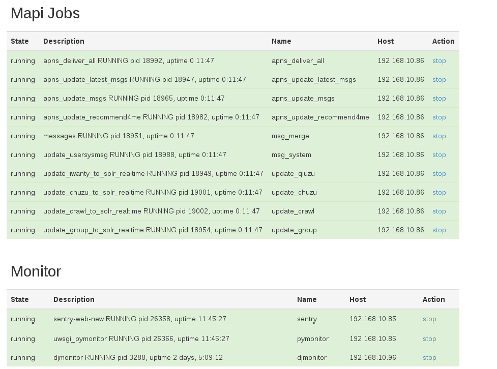

django-supervisorctl
====================

Another Django app to watch and control services on multi host. Based on supervisor

supervisorctl depends on:

1. Supervisor 

   http://supervisord.org/ 

2. Django 

   https://www.djangoproject.com/

Sample:

.. toctree::
   :maxdepth: 2
