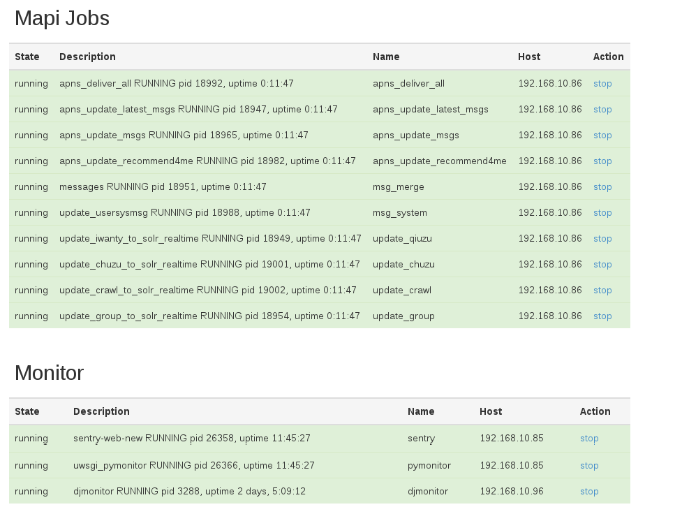

.. Supervisorctl documentation master file, created by
   sphinx-quickstart on Thu Oct 31 23:20:55 2013.
   You can adapt this file completely to your liking, but it should at least
   contain the root `toctree` directive.

Welcome to Supervisorctl's documentation!
=========================================
supervisorctl depends on:

1. Supervisor 

   http://supervisord.org/ 

2. Django 

   https://www.djangoproject.com/

Sample:

.. toctree::
   :maxdepth: 2

Indices and tables
==================

* :ref:`genindex`
* :ref:`modindex`
* :ref:`search`

